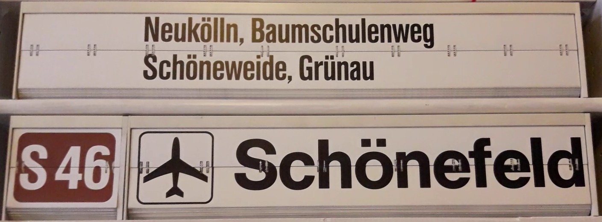
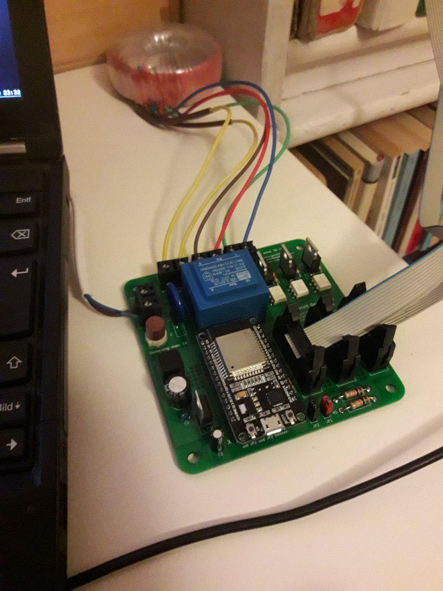
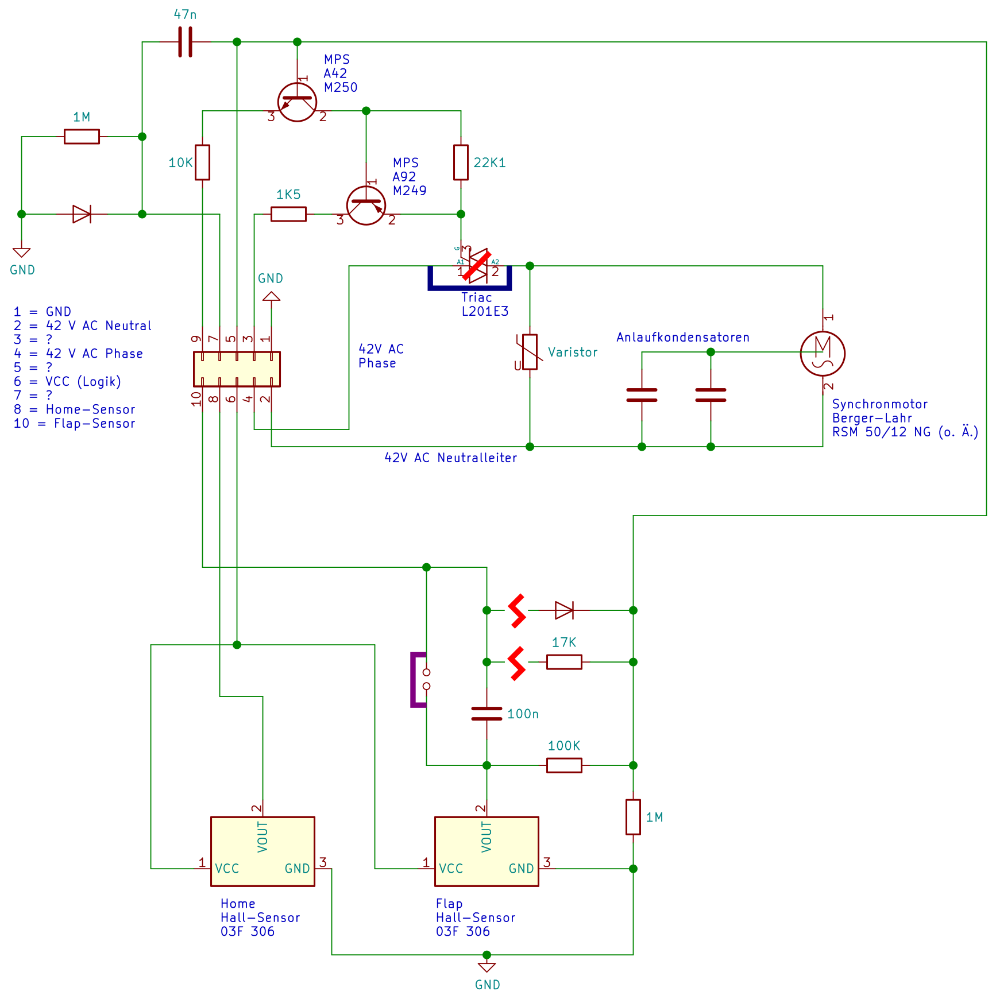
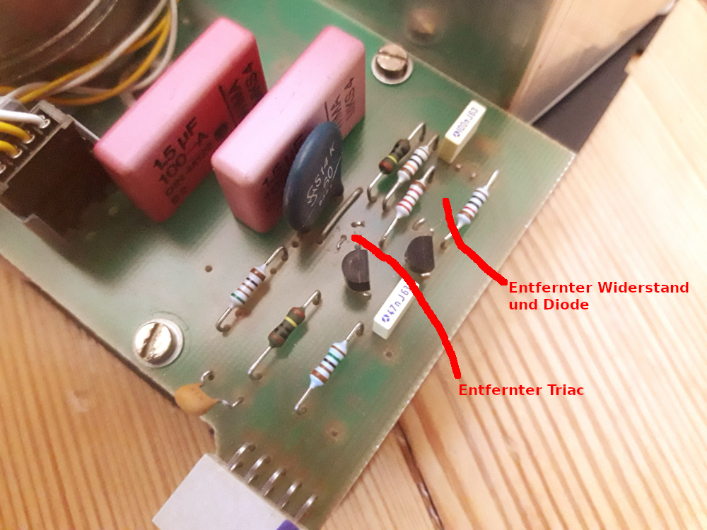
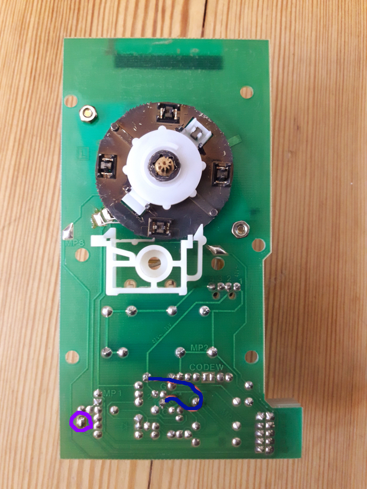
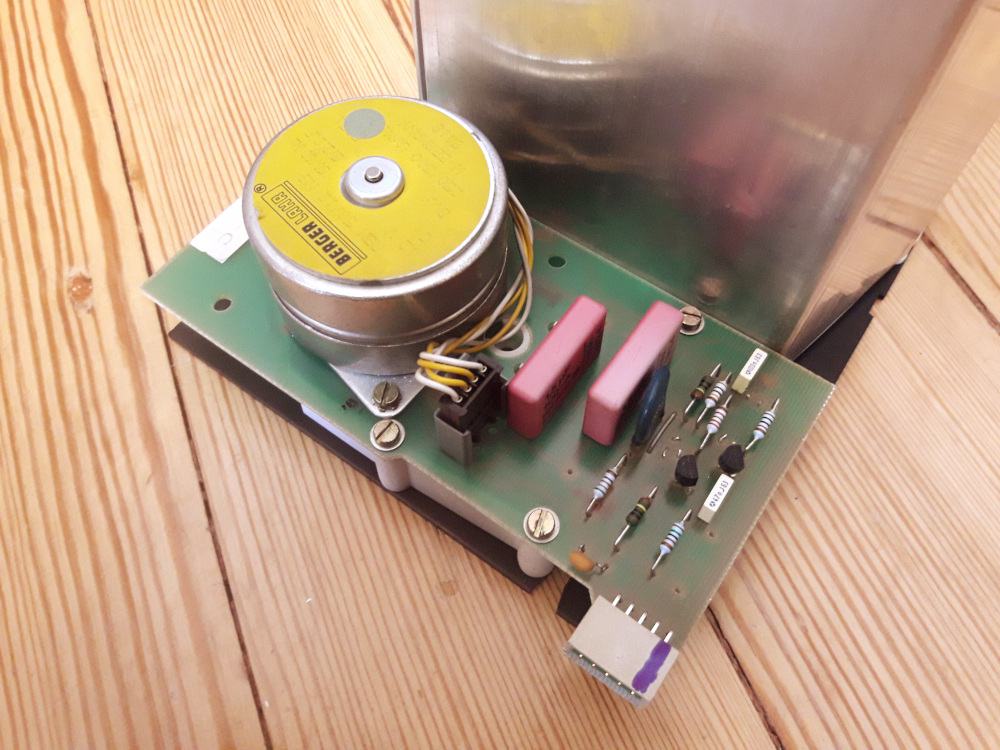
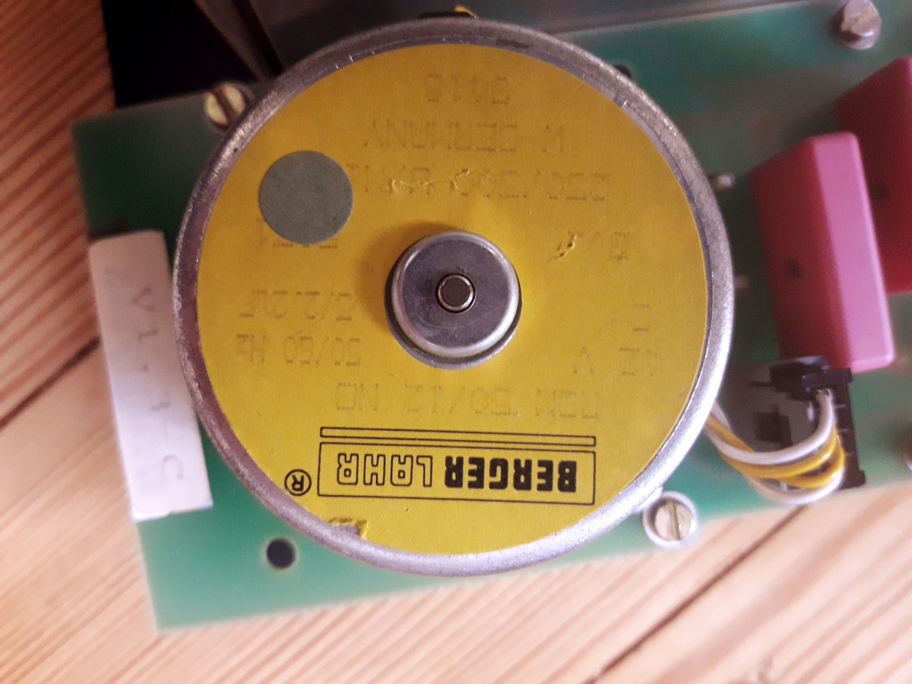
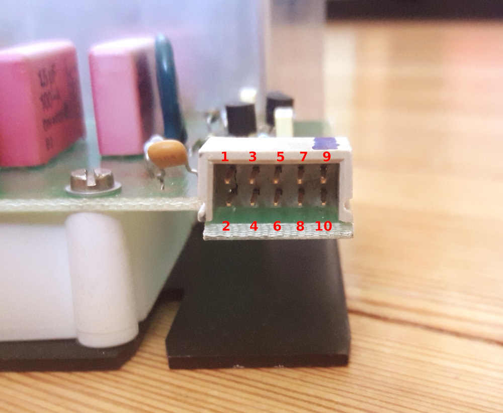

# Fallblattanzeiger der S-Bahn-Berlin

Platine zur Ansteuerung von 3 Fallblattmodulen (typischerweise Linie, Fahrtziel und Laufweg) mit einem ESP32-Development-Board. Gedacht für Module der *Epoche 2* (siehe [Wikipedia](https://de.wikipedia.org/wiki/Fallblattanzeige)) und ein Eingriff in die Platine der Module ist erforderlich. Der Synchronmotor wird nicht über die Transistorschaltung auf der Platine des Fallblattmoduls gesteuert. Vielmehr wird die Platine so überbrückt, dass der Microcontroller direkten Zugriff auf die Hall-Sensoren hat und über einen eigenen Triac den Synchronmotor direkt steuert.

Zur Stromversorgung wird die Platine an 230 V Netzspannung angeschlossen. Ein großer Trafo, der nicht auf der Platine verbaut wird, sondern über Schraubklemmen angeschlossen werden kann, spannt auf 48V AC herunter. Damit werden die Synchronmotoren der Module betrieben. Ein weiterer Trafo, der auf der Platine montiert wird, spannt auf 9V AC herunter, die gleichgerichtet und mit einem Linearregler auf Logik-Betriebsspannung 3,3V gebracht werden.

## Modifikationen an der Platine des Fallblattmoduls

Der unveränderte Schaltplan der Platine ist als [KiCad-Schaltplan](images/schaltplan-modul/schaltplan-modul.sch) und [PDF](images/schaltplan-modul.pdf) im Repo abgelegt. Soweit möglich, sind Typenbezeichnung der Bauteile mit angegeben, diese sind allerdings mit Google heute nur schwer zu deuten.

Ähnlich wie bei den modernen Varianten (siehe auch [fallblatt-schematics-ep3](https://github.com/julianschick/fallblatt-schematics-ep3)) der Fallblattmodule sind zwei Sensoren verbaut: Ein Sensor, der jedes fallende Blatt zählt (Flap) und einen, der ein bestimmtes Blatt als Nullstellung markiert (Home). Im Gegensatz zu den moderneren Exemplaren sind das allerdings keine Photodioden sondern Hall-Sensoren, an denen ein Magnet vorbeistreicht. Wenn kein Magnet in der Nähe ist, liegt auf dem Ausgang des Sensors VCC an, kommt der Magnet vorbei, so wird der Ausgang sehr sauber (ohne Gewackel) auf GND gezogen. Im Betrieb mit dem Mikrocontroller habe ich allerdings festgestellt, dass die Flap-Sensoren einerseits gerne etwas zu früh triggern, sodass das Blatt noch klemmt, und andererseits beim erneuten Anlaufen manchmal durch die Induktion des in Bewegung gesetzten Magneten noch einmal kurz getriggert werden. Gelöst habe ich beide Probleme auf Softwareseite durch etwas längeres Weiterlaufen und durch ignorieren des Flap-Sensors direkt nach dem Anlaufen.

Die folgenden Pläne und Bilder zeigen die notwendigen Modifikationen. Einmal wird Pin 5 des Anschlusssteckers von Pin 10 des Anschlusssteckers getrennt, indem ein Widerstand und eine Diode entfernt werden. Außerdem wird Pin 10 direkt mit dem Flap-Hall-Sensor verbunden, durch setzen einer Brücke auf der Platine, wo schon zwei vorbereitete Pads nebeneinander liegen (violette Brücke). Zuletzt wird der Triac entfernt und überbrückt (blaue Brücke).

**Schaltplan mit Modifikationen**

Dieses Bild auch als [PDF](images/schaltplan-modul-modifikationen.pdf) und [SVG](images/schaltplan-modul-modifikationen.svg).

**Modifikationen an der Platine** (blaue und violette Brücke, entfernte Teile)

 

**Gesamte Platine des Fallblattmoduls / Synchronmotor**

 

**Polbelegung des Anschlusses**

## Teileliste

* ESP32-Development-Board (es gibt 2 Varianten bei eBay, für diese Platine wird die üblichere mit 15 Pins je Reihe und GND/VCC  nebeneinander, nicht auf gegenüberliegenden Pins benötigt; diese wird oft unter dem Namen _DEVKITV1_ oder _NodeMCU_ verkauft). Das folgende Pinout ist das korrekte:

* Netztrafo 48V (eigentlich 42V) mit Wumms, mind. 200mA pro Modul, der Synchronmotor zieht so viel. Zum Beispiel [der hier](https://www.voelkner.de/products/1011896/TRU-Components-TC-RKT30-2X24-Ringkerntransformator-1-x-230V-2-x-24V-30-VA-625mA.html)
* [Transformator 9V _Block VB 2,0/1/9_](https://www.reichelt.de/printtrafo-2-va-9-v-222-ma-rm-20-mm-ei-30-15-5-109-p27328.html)
* Rundsicherung 1A mit Halter Littelfuse, RM 5mm
* Varistor, mind. 300V, RM 10mm
* [Brückengleichrichter Rund, Wechselstrompins gegenüber, RM 5mm](https://www.reichelt.de/brueckengleichrichter-100-v-1-5-a-b70c1500rund-p181713.html)
* 4 x Schraubklemme 2-polig RM 7,5mm
* [Spannungsregler 3,3V Formfaktor TO-220 _STM LD1117 V33C_](https://www.reichelt.de/ldo-regler-fest-3-3-v-to-220-ld1117-v33c-p200891.html?)
* 3 x Optotriac (Triac mit Optokoppler) MOC3041M
* 3 x Leistungstriac BT136-600
* Elektrolytkondensator 470u, RM 5mm
* Elektrolytkondensator 10u, RM 2mm
* Kondensator 100n, RM 2,5mm
* 6 x Widerstand 10K, RM 15mm
* 3 x Widerstand 220, RM 10mm
* 3 x Widerstand 330, RM 10mm
* 2 x Jumpersteckplatz und 2 x Pinheader Female für das ESP32-Board
* 3 x Anschlüsse für die Fallblattmodule (2 x 5 Pole), RM 2,54mm

